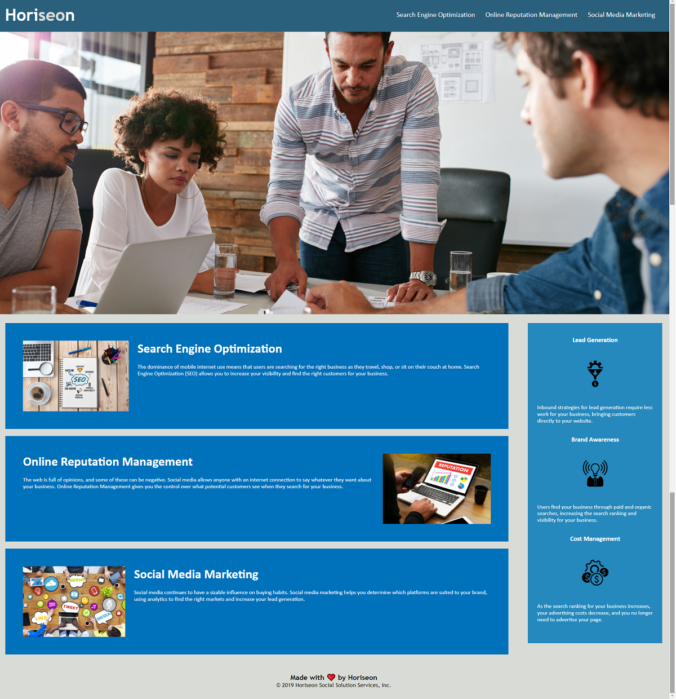

# Seo Accesibility Project
Homework 1 About Seo Accesibility

## Description

For a marketing agency I made a codebase that follows accessibility standarts so that their website is optimized for search engines

* Made sure the links are working properly
* CSS selectors and properities are consolidated and organized to follow semantic structure
* CSS File is properly commented
* Followed the Scout rule

The link to the deployed application : [Link to Project](https://erenozgur98.github.io/seo-accesibility-hw1/)

The link to my github account : [Link to GitHub Profile](https://github.com/erenozgur98)

